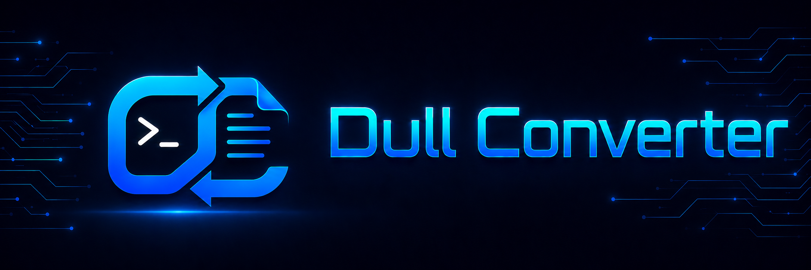
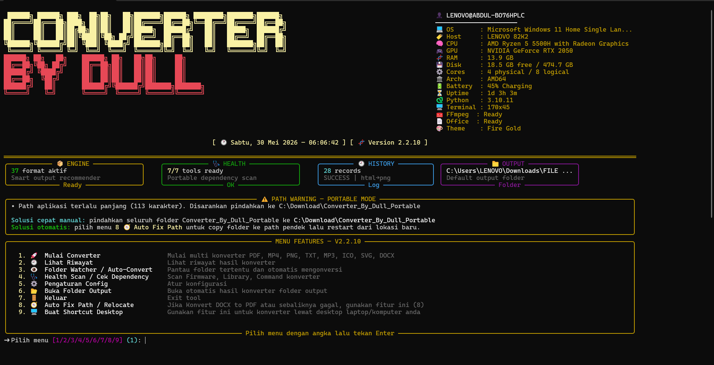
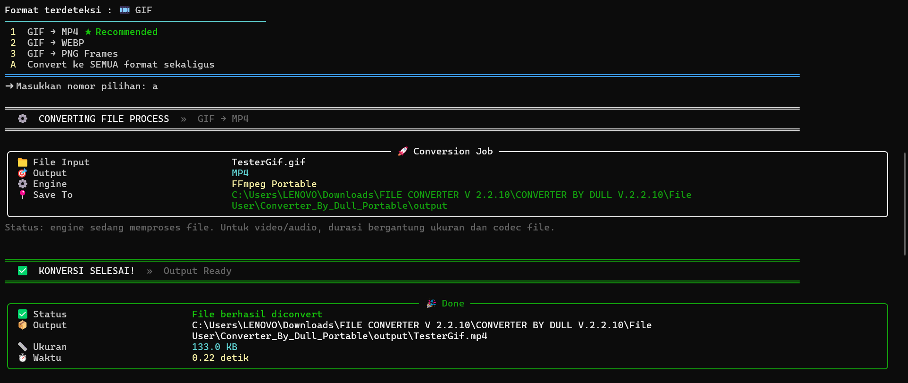

<div align="center">

<!-- LOGO PLACEHOLDER -->
<!-- Replace the line below with your actual logo image -->
<!-- Example:  -->

# Multi Converter - by @dull goodman


<br/><br/>

<!-- BADGES -->
[](https://github.com/root-abdullLabs)
[](https://github.com/root-abdullLabs/Dull_Converter)
[](https://github.com/root-abdullLabs/Dull_Converter/releases/tag/2.2.10)
[](LICENSE)
<br/>

**Converter By Dull** is a powerful, portable, all-in-one file converter for Windows — no installation required. Convert documents, images, audio, video, spreadsheets, and more directly from your desktop via a simple CLI menu.

</div>

---

## Screenshots

<div align="center">
  
  <br/><em>Main Menu</em>
  <br/><br/>
  
  <br/><em>Drop File</em>
  <br/><br/>
  
  <br/><em>File Conversion</em>
  <br/><br/>
  
  <br/><em>Health Scan</em>
</div>

---

## Features

| No | Feature | Description |
|----|---------|-------------|
| 1 | **Multi-Format Converter** | Convert PDF, MP4, MKV, ACC, PNG, TXT, MP3, ICO, SVG, DOCX, GIF, HTML, JSON, XLXS, and many more |
| 2 | **Conversion History** | View and track all your previous conversion results |
| 3 | **Folder Watcher / Auto-Convert** | Monitor a folder and automatically convert new files as they appear |
| 4 | **Health Scan** | Scan and verify all firmware, libraries, and converter dependencies |
| 5 | **Config Settings** | Customize the tool's behavior and output preferences |
| 6 | **Auto Open Output Folder** | Automatically opens the output folder after conversion |
| 7 | **Auto Fix Path / Relocate** | Fixes broken paths when DOCX↔PDF conversion fails |
| 8 | **Desktop Shortcut Creator** | Create a desktop shortcut for quick access on any PC |

---

## Supported Conversions

<details>
<summary><b>📄 Document Formats</b></summary>

| Input | Output Formats |
|-------|---------------|
| PDF | DOCX, PNG, JPG, TXT |
| DOCX / DOC | PDF, TXT |
| TXT | PDF, DOCX |
| PPTX / PPT | PDF, PNG |
| HTML / HTM | PDF, PNG |

</details>

<details>
<summary><b>🖼️ Image Formats</b></summary>

| Input | Output Formats |
|-------|---------------|
| PNG | JPG, WEBP, SVG, PDF, ICO |
| JPG / JPEG | PNG, WEBP, SVG, PDF, ICO |
| WEBP | PNG, JPG, SVG, PDF, ICO |
| SVG | PNG, JPG, WEBP, PDF |
| GIF | MP4, WEBP, PNG Frames |

</details>

<details>
<summary><b>🎬 Video Formats</b></summary>

| Input | Output Formats |
|-------|---------------|
| MP4, MKV, AVI, MOV, WMV, WEBM, FLV | MP4, MKV, AVI, WEBM, GIF, MP3, WAV, M4A |

</details>

<details>
<summary><b>🎵 Audio Formats</b></summary>

| Input | Output Formats |
|-------|---------------|
| MP3, AAC, WAV, FLAC, OGG, M4A, WMA | MP3, AAC, WAV, FLAC, OGG, M4A |

</details>

<details>
<summary><b>📊 Data & Spreadsheet Formats</b></summary>

| Input | Output Formats |
|-------|---------------|
| XLSX / XLS | CSV, PDF, HTML |
| CSV | Excel (.xlsx), JSON |
| JSON | CSV, XML, YAML |

</details>

<details>
<summary><b>📺 YouTube Downloader</b></summary>

| Source | Output Formats |
|--------|---------------|
| YouTube URL | MP3, MP4 |

</details>

---

## 🌐 Browser Version vs Desktop CLI Version

| Feature | Browser Version | Desktop CLI Version |
|---------|:-----------------:|:---------------------:|
| Lightweight file conversion | ✅ | ✅ |
| No installation required | ✅ | ✅ *(Portable ZIP)* |
| Image conversion | ⚠️ Limited | ✅ Full |
| Document conversion | ⚠️ Limited | ✅ Full |
| Video conversion | ❌ | ✅ |
| Audio conversion | ❌ | ✅ |
| YouTube MP3/MP4 download | ❌ | ✅ |
| Batch conversion | ❌ | ✅ |
| Health scan & dependency check | ❌ | ✅ |
| Auto path fix / relocate | ❌ | ✅ |
| Desktop shortcut creator | ❌ | ✅ |

---

## ⬇️ Download

Download the latest portable version directly from the release page:

🔗 **[https://github.com/root-abdullLabs/Dull_Converter/releases/tag/2.2.10](https://github.com/root-abdullLabs/Dull_Converter/releases/tag/2.2.10)**
**[💬 Feedback & Contact](https://github.com/root-abdullLabs/Dull_Converter#-feedback--contact)**

```
Converter_By_Dull_v2.2.10.zip
```

---

## How to Use

1. **Download** the ZIP file from the release page above.
2. **Extract** the ZIP file to your preferred location.
3. **Open** the extracted folder.
4. **Run** the launcher by double-clicking:
   ```
   START_CONVERTER_BY_DULL.bat
   ```
5. **Select** a menu option using the number keys.
6. **Done!** Converted files are automatically saved to the `output` folder.

---

## Output Folder

By default, all converted files are saved to:

```
Converter_By_Dull_Portable\output
```
```
You can change the output folder location anytime through the Settings / Config menu (option `5` from the main menu). Set it to any folder you prefer on your system.
```

---

## Recommended Installation Path

For best performance and to avoid **Windows long path issues**, place the portable folder in a short directory path:

```
C:\Users\Download\Converter_By_Dull_Portable
```

> ⚠️ Avoid placing the folder in deeply nested directories or paths with spaces, as this may cause issues with LibreOffice-based conversions (DOCX ↔ PDF).

---

<div align="center">

## ⚠️ Disclaimer

**Converter By Dull is created to help users convert personal files more easily and efficiently. Users are solely responsible for ensuring they have the proper rights, permissions, or licenses to convert, download, or process any file used with this tool. The developer is not responsible for any misuse of this software, including but not limited to converting copyrighted content without authorization. Use this tool responsibly and in accordance with applicable laws and regulations.**

---


<div align="center">

Made with ❤️ by [root-abdullLabs](https://github.com/root-abdullLabs)

⭐ If you find this tool useful, please consider giving the repository a **star**!

</div>
